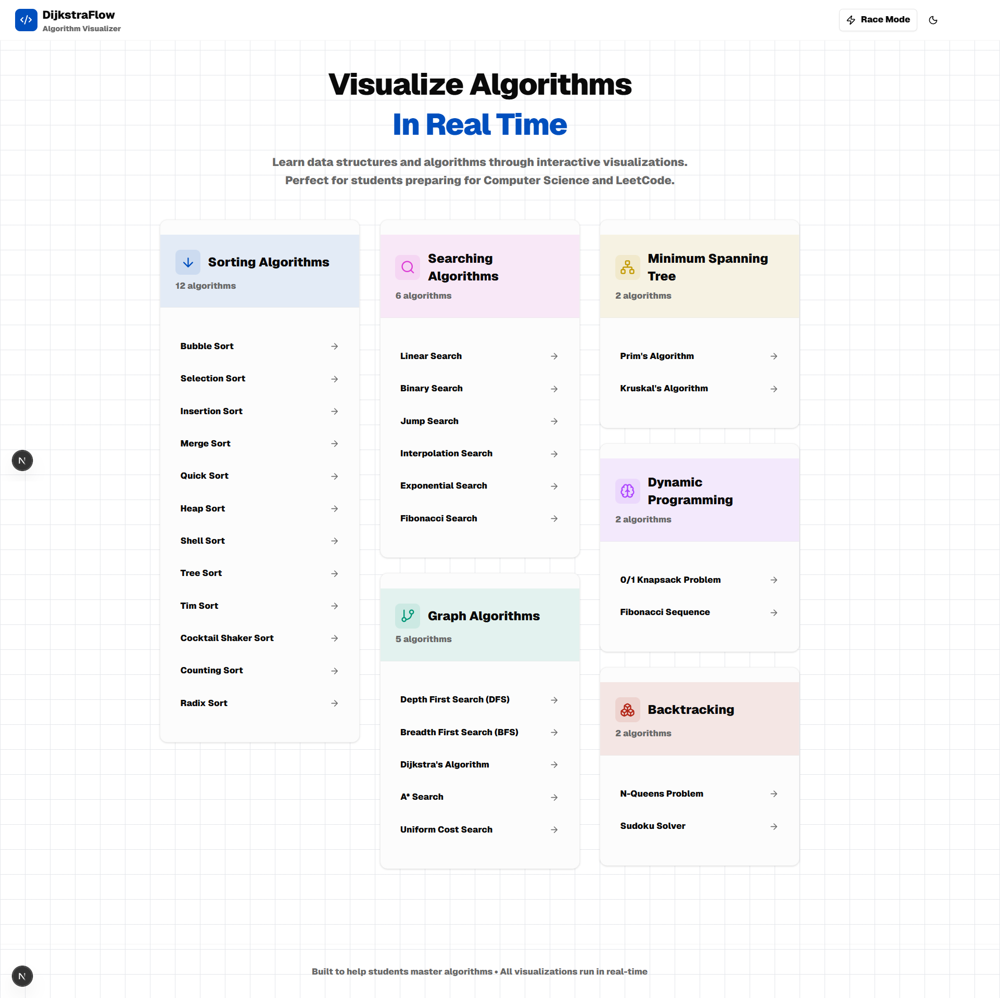
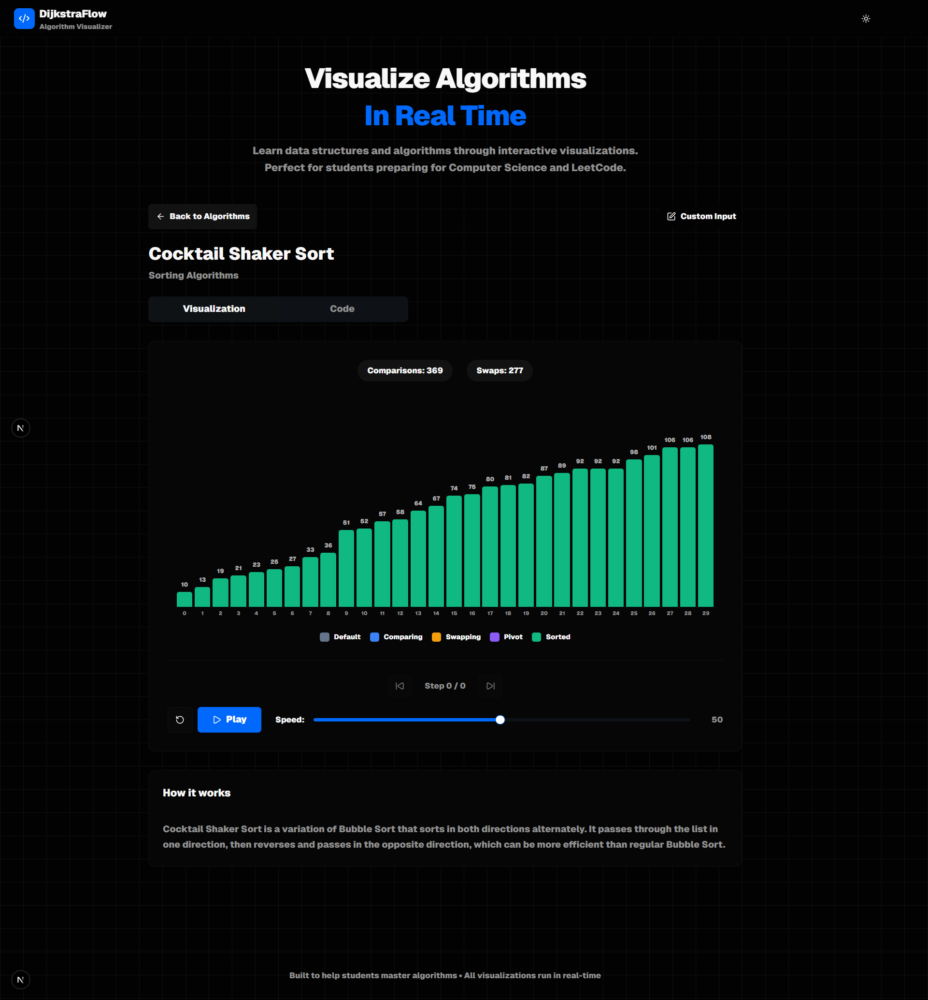
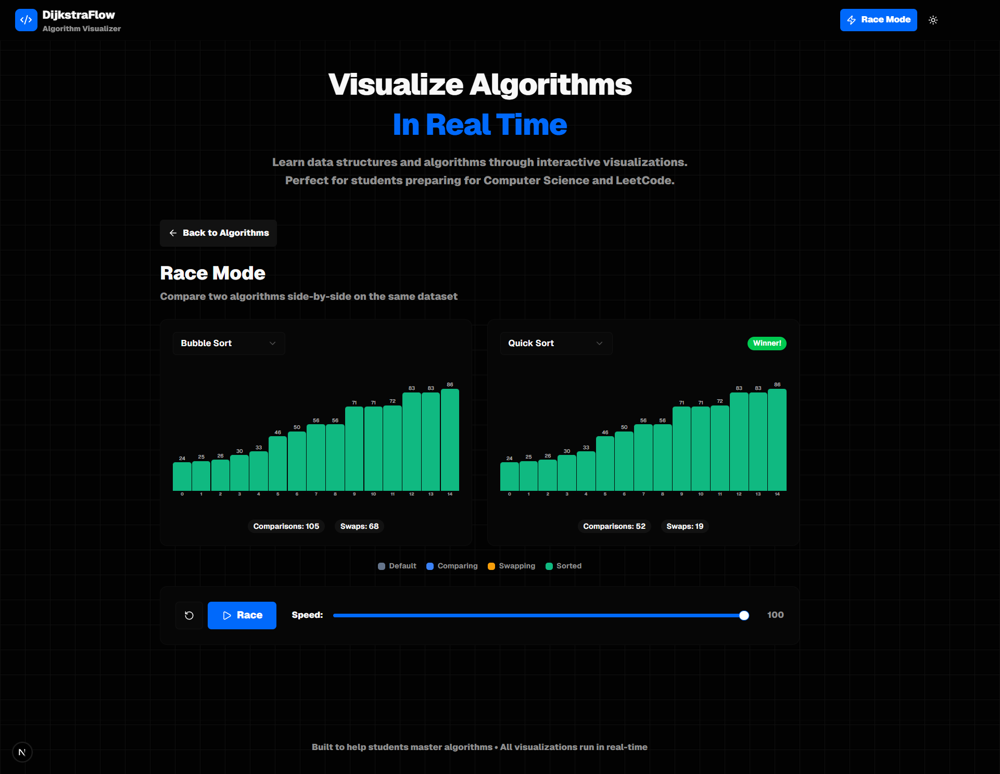

# DijkstraFlow

<div align="center">

**An Interactive Algorithm Visualization Platform**

[](https://nextjs.org/)
[](https://reactjs.org/)
[](https://www.typescriptlang.org/)
[](https://tailwindcss.com/)

*Learn data structures and algorithms through interactive visualizations*

</div>

---

## 📋 Table of Contents

- [Overview](#overview)
- [Features](#features)
- [Technologies](#technologies)
- [Installation](#installation)
- [Usage](#usage)
- [Algorithms](#algorithms)
- [Project Structure](#project-structure)
- [Development](#development)
- [Contributing](#contributing)
- [License](#license)

## 🎯 Overview

DijkstraFlow is a comprehensive, interactive web application designed to help students and developers understand algorithms and data structures through real-time visualizations. Whether you're preparing for technical interviews, studying computer science, or simply curious about how algorithms work, DijkstraFlow provides an intuitive and engaging learning experience.



### Key Highlights

- **30+ Algorithms** across 6 major categories
- **Real-time Visualizations** with step-by-step execution
- **Race Mode** to compare algorithms side-by-side
- **Code Snippets** in JavaScript, Python, and Java
- **Custom Input** support for hands-on experimentation
- **Dark/Light Theme** for comfortable viewing
- **Responsive Design** optimized for all devices

## ✨ Features

### 🎨 Interactive Visualizations



- **Step-by-step Execution**: Watch algorithms execute with detailed step-by-step animations
- **Speed Control**: Adjustable animation speed (1-100) for optimal learning pace
- **Step Navigation**: Move forward and backward through algorithm steps
- **Visual States**: Color-coded elements showing comparisons, swaps, sorted states, and more
- **Statistics Tracking**: Real-time display of comparisons, swaps, and other metrics
- **Graph Visualizations**: Interactive node-link graphs with distance labels, edge weights, and path highlighting
- **Total Cost Display**: Shows cumulative weight of shortest path edges for graph algorithms
- **Performance Metrics**: Track computations, queue size, and path distances in real-time

### 🏁 Race Mode



- **Side-by-Side Comparison**: Compare two sorting algorithms simultaneously
- **Shared Dataset**: Both algorithms operate on the same input data
- **Performance Metrics**: Track comparisons and swaps for each algorithm
- **Winner Detection**: Automatically identifies the most efficient algorithm

### 💻 Code Learning

- **Multi-language Support**: View implementations in JavaScript, Python, and Java
- **Well-documented Code**: Comprehensive comments and explanations
- **Time & Space Complexity**: Detailed complexity analysis for each algorithm
- **Best Practices**: Clean, production-ready code examples

### 🎛️ Customization

- **Custom Input**: Provide your own data for sorting and searching algorithms
- **Graph Editor**: Create custom graphs for graph algorithm visualizations
- **Random Graph Generation**: Automatically generate random weighted graphs for pathfinding algorithms
- **Theme Toggle**: Switch between light and dark modes
- **Responsive Layout**: Optimized for desktop, tablet, and mobile devices

## 🛠️ Technologies

### Core Framework

- **[Next.js 16.0.4](https://nextjs.org/)** - React framework for production
- **[React 19.2.0](https://reactjs.org/)** - UI library
- **[TypeScript 5.0](https://www.typescriptlang.org/)** - Type-safe JavaScript

### Styling & UI

- **[Tailwind CSS 4.0](https://tailwindcss.com/)** - Utility-first CSS framework
- **[Radix UI](https://www.radix-ui.com/)** - Accessible component primitives
- **[Framer Motion](https://www.framer.com/motion/)** - Animation library
- **[Lucide React](https://lucide.dev/)** - Icon library

### Development Tools

- **ESLint** - Code linting
- **PostCSS** - CSS processing
- **Geist Font** - Modern typography

## 📦 Installation

### Prerequisites

- **Node.js** 18.0 or higher
- **npm** or **yarn** package manager

### Setup Instructions

1. **Clone the repository**

   ```bash
   git clone <repository-url>
   cd dijkstraflow
   ```

2. **Install dependencies**

   ```bash
   npm install
   # or
   yarn install
   ```

3. **Run the development server**

   ```bash
   npm run dev
   # or
   yarn dev
   ```

4. **Open your browser**

   Navigate to [http://localhost:3000](http://localhost:3000)

### Build for Production

```bash
npm run build
npm start
```

## 🚀 Usage

### Basic Navigation

1. **Select an Algorithm**: Browse algorithms by category on the home page
2. **Start Visualization**: Click "Play" to begin the animation
3. **Control Speed**: Use the speed slider to adjust animation speed
4. **Step Through**: Use step forward/backward buttons for precise control
5. **View Code**: Switch to the "Code" tab to see implementations

### Race Mode

1. **Enable Race Mode**: Click the "Race Mode" button on the home page
2. **Select Algorithms**: Choose two sorting algorithms from the dropdowns
3. **Start Race**: Click "Race" to begin simultaneous execution
4. **Compare Results**: View statistics and see which algorithm finishes first

### Custom Input

1. **Open Custom Input Dialog**: Click the custom input button in the visualizer
2. **Enter Data**: Provide your own array of numbers (comma-separated)
3. **Submit**: The visualization will use your custom data

### Graph Algorithms

1. **Select Graph Algorithm**: Choose from Dijkstra's, A*, or Uniform Cost Search
2. **View Graph**: See nodes and edges with weights displayed
3. **Watch Path Finding**: Observe the algorithm finding the shortest path
4. **Monitor Metrics**: Track computations, queue size, distance, and total cost
5. **Randomize Graph**: Click "Randomize" to generate a new graph layout

## 📚 Algorithms

### Sorting Algorithms (12)

- **Bubble Sort** - Simple comparison-based sorting
- **Selection Sort** - Finds minimum and places it
- **Insertion Sort** - Builds sorted array incrementally
- **Merge Sort** - Divide and conquer approach
- **Quick Sort** - Efficient pivot-based sorting
- **Heap Sort** - Uses binary heap data structure
- **Shell Sort** - Optimized insertion sort variant
- **Tree Sort** - Binary search tree-based sorting
- **Tim Sort** - Hybrid merge/insertion sort
- **Cocktail Shaker Sort** - Bidirectional bubble sort
- **Counting Sort** - Non-comparison integer sorting
- **Radix Sort** - Digit-by-digit sorting

### Searching Algorithms (6)

- **Linear Search** - Sequential search through array
- **Binary Search** - Divide and conquer search
- **Jump Search** - Jump ahead by fixed steps
- **Interpolation Search** - Improved binary search for uniform data
- **Exponential Search** - Finds range then binary searches
- **Fibonacci Search** - Uses Fibonacci numbers to divide array

### Graph Algorithms (5)

- **Depth First Search (DFS)** - Explores as far as possible with maze visualization
- **Breadth First Search (BFS)** - Level-by-level exploration with maze visualization
- **Dijkstra's Algorithm** - Shortest path in weighted graphs with distance tracking and total cost display
- **A* Search** - Informed search with heuristics and path cost visualization
- **Uniform Cost Search** - Least-cost path finding with weighted edge visualization

### Minimum Spanning Tree (2)

- **Prim's Algorithm** - Greedy MST construction
- **Kruskal's Algorithm** - Union-Find based MST

### Backtracking (2)

- **N-Queens Problem** - Place N queens on chessboard
- **Sudoku Solver** - Solve 9×9 Sudoku puzzles

### Dynamic Programming (2)

- **0/1 Knapsack Problem** - Maximize value with weight constraint
- **Fibonacci Sequence** - Memoized Fibonacci calculation

## 📁 Project Structure

```
dijkstraflow/
├── app/
│   ├── globals.css          # Global styles and theme variables
│   ├── layout.tsx           # Root layout component
│   └── page.tsx             # Home page component
├── components/
│   ├── ui/                  # Reusable UI components
│   │   ├── button.tsx
│   │   ├── card.tsx
│   │   ├── dialog.tsx
│   │   ├── input.tsx
│   │   ├── select.tsx
│   │   ├── slider.tsx
│   │   ├── switch.tsx
│   │   └── ...
│   ├── visualizers/         # Algorithm-specific visualizers
│   │   ├── sorting-visualizer.tsx
│   │   ├── searching-visualizer.tsx
│   │   ├── graph-visualizer.tsx
│   │   ├── mst-visualizer.tsx
│   │   ├── backtracking-visualizer.tsx
│   │   └── dp-visualizer.tsx
│   ├── algorithm-selector.tsx    # Algorithm category browser
│   ├── algorithm-visualizer.tsx  # Main visualization container
│   ├── race-mode.tsx            # Race mode component
│   ├── code-snippets.tsx        # Code display component
│   ├── custom-input-dialog.tsx  # Custom input dialog
│   └── theme-toggle.tsx         # Theme switcher
├── lib/
│   ├── algorithm-descriptions.ts # Algorithm explanations
│   ├── code-snippets.ts         # Code implementations
│   └── utils.ts                  # Utility functions
├── package.json
├── tsconfig.json
├── next.config.ts
└── README.md
```

## 🔧 Development

### Available Scripts

- `npm run dev` - Start development server
- `npm run build` - Build for production
- `npm start` - Start production server
- `npm run lint` - Run ESLint

### Code Style

- TypeScript strict mode enabled
- ESLint configuration for code quality
- Consistent component structure
- Responsive design patterns

### Adding New Algorithms

1. **Add Algorithm Description**: Update `lib/algorithm-descriptions.ts`
2. **Add Code Snippets**: Update `lib/code-snippets.ts` with implementations
3. **Create Visualizer**: Add visualizer component in `components/visualizers/`
4. **Update Selector**: Add algorithm to appropriate category in `components/algorithm-selector.tsx`
5. **Implement Logic**: Add algorithm implementation in the visualizer

## 🤝 Contributing

Contributions are welcome! Please follow these guidelines:

1. **Fork the repository**
2. **Create a feature branch** (`git checkout -b feature/amazing-algorithm`)
3. **Make your changes** with clear commit messages
4. **Test thoroughly** across different browsers and devices
5. **Submit a pull request** with a detailed description

### Contribution Ideas

- Add new algorithms
- Improve visualizations
- Enhance UI/UX
- Fix bugs
- Write documentation
- Optimize performance
- Add new features

## 📄 License

This project is licensed under the MIT License - see the [LICENSE](LICENSE) file for details.

### License Summary

The MIT License is a permissive open-source license that allows:

- ✅ Commercial use
- ✅ Modification
- ✅ Distribution
- ✅ Private use

**With the following conditions:**
- Include the original copyright notice
- Include the license text

**No warranty or liability is provided.**

## 🙏 Acknowledgments

- Algorithm implementations inspired by classic computer science literature
- UI components built with [Radix UI](https://www.radix-ui.com/)
- Icons provided by [Lucide](https://lucide.dev/)
- Fonts by [Vercel Geist](https://vercel.com/font)

## 📞 Support

For questions, issues, or suggestions:

- Open an issue on GitHub
- Check existing documentation
- Review code comments for implementation details

## 🎓 Educational Use

DijkstraFlow is designed for educational purposes. It's perfect for:

- Computer Science students
- Coding bootcamp participants
- Technical interview preparation
- Algorithm enthusiasts
- Educators teaching algorithms